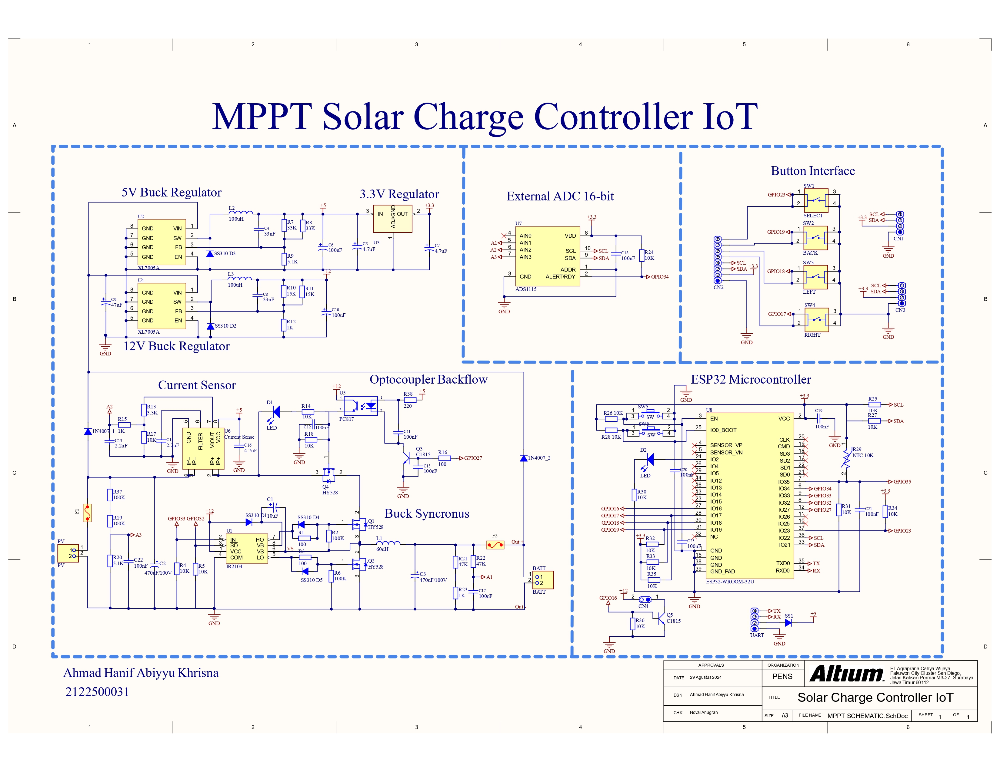
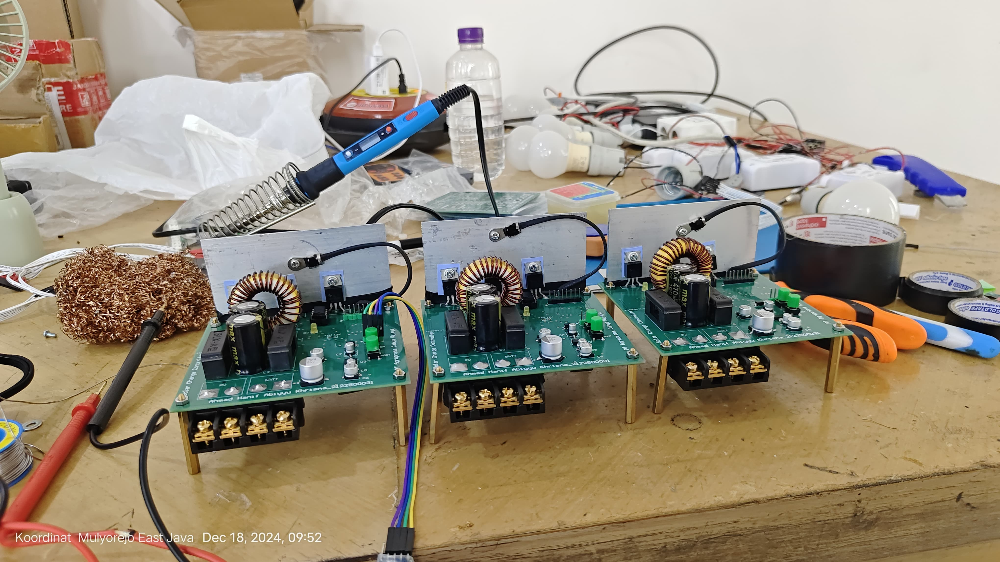

# MPPT Solar Charge Controller

A professional-grade Maximum Power Point Tracking (MPPT) Solar Charge Controller designed to optimize power extraction from photovoltaic (PV) panels. This repository contains the complete hardware design (schematics and PCB layout), firmware flowcharts, and system interface documentation.

## System Schematic
Core hardware architecture including power staging, sensor conditioning, and microcontroller integration.

## Firmware Architecture 
The system utilizes an advanced MPPT algorithm combined with comprehensive device protection and telemetry processes.

## PCB Layout & 3D Design
Optimized PCB layout ensuring proper thermal management, signal integrity, and high-current trace routing.

## Hardware Fabrication
Bare printed circuit boards fabricated with industrial standards.

## Physical Assembly & Testing
Fully assembled PCBA undergoing functional testing and calibration.

## User Interface & Telemetry
Local LCD menu navigation and digital dashboard for real-time monitoring of PV voltage, charging current, and battery status.
